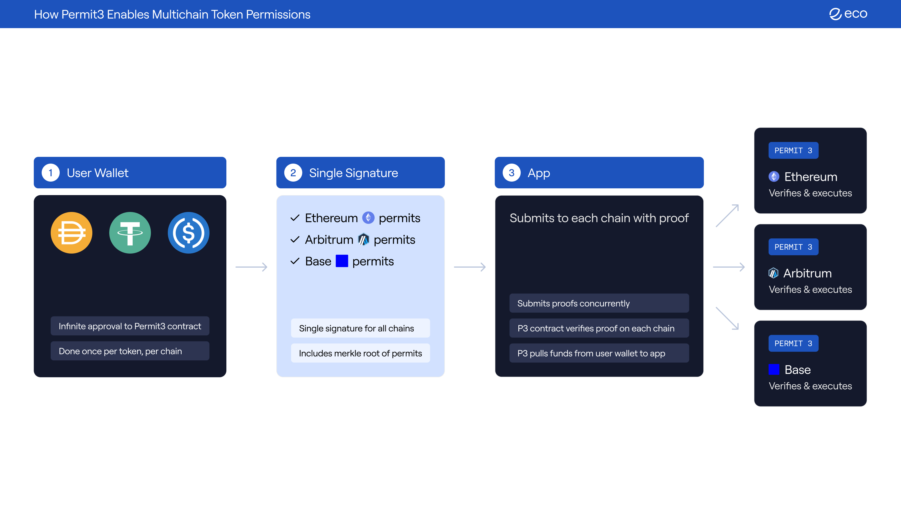

# Permit3: One-Click Cross-Chain Token Permissions

[](./LICENSE)

Permit3 is an approval system that enables **cross-chain token approvals and transfers with a single signature**. It unlocks a one-signature cross-chain future through Unbalanced Merkle Trees and non-sequential nonces, while maintaining Permit2 compatibility.


## Overview



## Deployment Information

Permit3 is deployed using [ERC-2470 Singleton Factory](https://eips.ethereum.org/EIPS/eip-2470) for deterministic addresses across all chains:

- **Deployment Address**: [`0xEc00030C0000245E27d1521Cc2EE88F071c2Ae34`](https://contractscan.xyz/contract/0xEc00030C0000245E27d1521Cc2EE88F071c2Ae34)

This ensures the same contract address on all supported networks, enabling seamless cross-chain operations.


## Key Features

- **Cross-Chain Operations**: Authorize token operations across multiple blockchains with one signature
- **Multi-Token Support**: Unified interface for ERC20, ERC721 NFTs, and ERC1155 semi-fungible tokens
- **Direct Permit Execution**: Execute permit operations without signatures when caller has authority
- **ERC-7702 Integration**: Account Abstraction support for enhanced user experience
- **Witness Functionality**: Attach arbitrary data to permits for enhanced verification and complex permission patterns
- **NFT & Semi-Fungible Token Features**:
    - Dual-allowance system (per-token and collection-wide)
    - TokenId encoding for signed permits
    - Batch operations for multiple token types
    - ERC1155 gaming asset support
- **Flexible Allowance Management**:
    - Increase/decrease allowances asynchronously
    - Time-bound permissions with automatic expiration
    - Account locking for enhanced security
- **Gas-Optimized Design**:
    - Non-sequential nonces for concurrent operations
    - Bitmap-based nonce tracking for efficient gas usage
    - Standard merkle proofs using OpenZeppelin's MerkleProof library
- **Emergency Security Controls**:
    - Cross-chain revocation system
    - Account locking mechanism
    - Time-bound permissions
- **Full Permit2 Compatibility**:
    - Implements basic transfer Permit2 interfaces
    - Drop-in replacement for existing integrations
- **Unbalanced Merkle Trees**: Hybrid two-part structure for cross-chain proofs:
  ```
                 [H1] → [H2] → [H3] → ROOT  ← Unbalanced upper structure
              /      \      \      \
            [BR]    [D5]   [D6]   [D7]      ← Additional chain data
           /     \
       [BH1]     [BH2]                      ← Balanced tree (bottom part)
      /    \     /    \
    [D1]  [D2] [D3]  [D4]                   ← Leaf data
  ```
  - **Unbalanced Design**: Combines balanced subtrees with unbalanced upper structure for efficiency
  - **Bottom Part**: Efficient membership proofs with O(log n) complexity
  - **Top Part**: Unbalanced structure minimizes proof size for expensive chains  
  - **Gas Optimization**: Chain ordering (cheapest chains first, expensive last)
  - **"Unbalanced"**: Deliberate deviation from balanced trees at top level
  - **Security**: Uses merkle tree verification for compatibility

## Documentation

Comprehensive documentation is available in the [docs](./docs) directory:

| Section | Description | Quick Links |
|---------|-------------|-------------|
| [Overview](./docs/README.md) | Getting started with Permit3 | [Introduction](./docs/README.md#getting-started) |
| [Core Concepts](./docs/concepts/README.md) | Understanding the fundamentals | [Architecture](./docs/concepts/architecture.md) · [Multi-Token](./docs/concepts/multi-token-support.md) · [Witnesses](./docs/concepts/witness-functionality.md) · [Cross-Chain](./docs/concepts/cross-chain-operations.md) · [Merkle Trees](./docs/concepts/unbalanced-merkle-tree.md) · [Nonces](./docs/concepts/nonce-management.md) · [Allowances](./docs/concepts/allowance-system.md) · [Permit2 Compatibility](./docs/concepts/permit2-compatibility.md) |
| [Guides](./docs/guides/README.md) | Step-by-step tutorials | [Quick Start](./docs/guides/quick-start.md) · [Multi-Token](./docs/guides/multi-token-integration.md) · [NFT Permits](./docs/guides/multi-token-signed-permits.md) · [ERC-7702](./docs/guides/erc7702-integration.md) · [Witness](./docs/guides/witness-integration.md) · [Cross-Chain](./docs/guides/cross-chain-permit.md) · [Signatures](./docs/guides/signature-creation.md) · [Security](./docs/guides/security-best-practices.md) |
| [API Reference](./docs/api/README.md) | Technical specifications | [Full API](./docs/api/api-reference.md) · [Data Structures](./docs/api/data-structures.md) · [Interfaces](./docs/api/interfaces.md) · [Events](./docs/api/events.md) · [Error Codes](./docs/api/error-codes.md) |
| [Examples](./docs/examples/README.md) | Code samples | [Multi-Token](./docs/examples/multi-token-example.md) · [ERC-7702](./docs/examples/erc7702-example.md) · [Witness](./docs/examples/witness-example.md) · [Cross-Chain](./docs/examples/cross-chain-example.md) · [Allowance](./docs/examples/allowance-management-example.md) · [Security](./docs/examples/security-example.md) · [Integration](./docs/examples/integration-example.md) |


## Core Concepts

### Allowance Operations

The protocol centers around the `AllowanceOrTransfer` structure:

```solidity
struct AllowanceOrTransfer {
    uint48 modeOrExpiration;    // Operation mode/expiration
    address token;              // Token address
    address account;            // Approved spender/recipient
    uint160 amountDelta;        // Amount change/transfer amount
}
```


### Timestamp Management

```solidity
struct Allowance {
    uint160 amount;
    uint48 expiration;
    uint48 timestamp;
}
```

- Timestamps order operations across chains
- Most recent timestamp takes precedence in expiration updates
- Prevents cross-chain race conditions
- Critical for async allowance updates

### Account Locking

Locked accounts have special restrictions:
- Cannot increase/decrease allowances
- Cannot execute transfers
- Must submit unlock command with timestamp validation to disable
- Provides emergency security control

## Integration

### Basic Setup
```solidity
// Access Permit2 compatibility
IPermit permit = IPermit(PERMIT3_ADDRESS);
permit.transferFrom(msg.sender, recipient, 1000e6, USDC);

// Access Permit3 features
IPermit3 permit3 = IPermit3(PERMIT3_ADDRESS);
```
### Direct Multi-Token Functions

For direct transfers without signatures, use specialized functions:

```solidity
// NFT transfer
permit3.transferFromERC721(from, to, nftContract, tokenId);

// ERC1155 transfer  
permit3.transferFromERC1155(from, to, erc1155Contract, tokenId, amount);

// Batch mixed tokens
TokenTypeTransfer[] memory transfers = [...];
permit3.batchTransferMultiToken(transfers);
```

### Example Operations

```solidity
// 1. Create permits array directly
AllowanceOrTransfer[] memory permits = new AllowanceOrTransfer[](3);

// 2. Increase Allowance
permits[0] = AllowanceOrTransfer({
    modeOrExpiration: uint48(block.timestamp + 1 days),
    token: USDC,
    account: DEX,
    amountDelta: 1000e6
});

// 3. Lock Account
permits[1] = AllowanceOrTransfer({
    modeOrExpiration: 2,
    token: USDC,
    account: address(0),
    amountDelta: 0
});

// 4. Execute Transfer
permits[2] = AllowanceOrTransfer({
    modeOrExpiration: 0,
    token: USDC,
    account: recipient,
    amountDelta: 500e6
});

// Execute the permits
permit3.permit(owner, salt, deadline, timestamp, permits, signature);
```

### Cross-Chain Usage with Merkle Proofs

```javascript
// Create permits for each chain
const ethPermits = {
    chainId: 1,
    permits: [{
        modeOrExpiration: futureTimestamp,
        token: USDC_ETH,
        account: DEX_ETH,
        amountDelta: 1000e6
    }]
};

const arbPermits = {
    chainId: 42161,
    permits: [{
        modeOrExpiration: 1, // Decrease mode
        token: USDC_ARB,
        account: DEX_ARB,
        amountDelta: 500e6
    }]
};

// Hash each chain's permits to create leaf nodes
const ethLeaf = permit3.hashChainPermits(ethPermits);
const arbLeaf = permit3.hashChainPermits(arbPermits);

// Build merkle tree and get root (typically done off-chain)
const leaves = [ethLeaf, arbLeaf];
const merkleRoot = buildMerkleRoot(leaves);

// Generate merkle proof for specific chain
const arbProof = generateMerkleProof(leaves, 1); // Index 1 for Arbitrum
const proof = { nodes: arbProof };

// Create and sign with the unbalanced root
const signature = signPermit3(owner, salt, deadline, timestamp, merkleRoot);
```

## Security Guidelines

1. **Allowance Management**
    - Set reasonable expiration times
    - Use lock mode for sensitive accounts
    - Monitor allowance changes across chains

2. **Timestamp Validation**
    - Validate operation ordering
    - Check for expired timestamps
    - Handle locked state properly

3. **Cross-Chain Security**
    - Verify chain IDs match
    - Use unique nonces
    - Monitor pending operations

## Tree-Based Cross-Chain Permits

Permit3 supports tree-based cross-chain permits that provide UI transparency through EIP-712 signatures. This allows users to see all chain permits they're signing while maintaining gas-efficient on-chain verification.

### Overview

When signing permits for multiple chains, users sign a complete `PermitNode` tree structure that shows:
- All chains included in the permit
- All token operations for each chain
- The tree structure organizing the permits

The on-chain contract receives:
- A compact `bytes32 proofStructure` encoding (position + type flags)
- A proof array (sibling hashes along the Merkle path)
- The permits for the current chain

### Key Concepts

#### PermitNode Structure

```solidity
struct PermitNode {
    PermitNode[] nodes;      // Child nodes (nested structures)
    ChainPermits[] permits;  // Leaf nodes (actual chain permits)
}
```

#### Three Combination Rules

1. **Permit + Permit**: Two chain permit leaves are combined with alphabetical sorting
2. **Node + Node**: Two nested structures are combined with alphabetical sorting
3. **Node + Permit**: Mixed types use struct order (nodes first, no sorting)

#### Tree Structure Encoding (bytes32)

- **Byte 0**: Position index (reserved for future use)
- **Bytes 1-31**: Type flags (one bit per proof element)
  - 0 = Proof element is a Permit (ChainPermits leaf)
  - 1 = Proof element is a Node (PermitNode)

### JavaScript Usage Example

```javascript
const { buildOptimalPermitTree, encodeProofStructure, signPermitNodePermit } =
    require('./utils/permitNodeHelpers');

// Create permits for multiple chains
const chainPermits = [
    { chainId: 1, permits: [{ modeOrExpiration: 1000, tokenKey: '0x...', account: '0x...', amountDelta: 1000 }] },
    { chainId: 42161, permits: [{ modeOrExpiration: 1000, tokenKey: '0x...', account: '0x...', amountDelta: 2000 }] },
    { chainId: 10, permits: [{ modeOrExpiration: 1000, tokenKey: '0x...', account: '0x...', amountDelta: 3000 }] }
];

// Build optimal tree
const tree = buildOptimalPermitTree(chainPermits);

// Generate proof for specific chain (e.g., Ethereum mainnet)
const encoding = encodeProofStructure(tree, 1);
// Returns: { proofStructure: '0x...', proof: ['0x...'], currentChainPermits: {...} }

// Sign the complete tree (user sees all chains)
const signature = await signPermitNodePermit(tree, owner, salt, deadline, timestamp, signer, permit3Address);

// Execute on Ethereum mainnet
await permit3.permit(owner, salt, deadline, timestamp, encoding.proofStructure,
    encoding.currentChainPermits, encoding.proof, signature);

// Execute on other chains with same signature, different proof
const arbEncoding = encodeProofStructure(tree, 42161);
await arbitrumPermit3.permit(owner, salt, deadline, timestamp, arbEncoding.proofStructure,
    arbEncoding.currentChainPermits, arbEncoding.proof, signature);
```

### Gas Costs

Gas costs scale linearly with proof length. Benchmarks from `test/PermitTreeGasBenchmark.t.sol`:

- **2 chains** (proof length 1): ~85,000 gas
- **4 chains** (proof length 2, balanced): ~90,000 gas
- **8 chains** (proof length 3, balanced): ~95,000 gas

Each additional proof element adds approximately 3,000-5,000 gas. Balanced trees minimize proof length.

### Security Model

The tree structure provides:
- **UI Transparency**: Users see complete permit structure when signing
- **Cryptographic Proof**: Merkle-like reconstruction ensures integrity
- **Replay Protection**: Nonce-based system prevents replay attacks
- **Deadline Protection**: Time-limited signatures prevent stale permits

For detailed documentation, see:
- [Tree Permits Developer Guide](./docs/TREE_PERMITS_GUIDE.md)
- [JavaScript Utilities README](./utils/README.md)
- [Security Documentation](./docs/SECURITY.md)

## Tree-Based Nonce Cancellation

Permit3 supports batch nonce cancellation using a tree-based structure that provides UI transparency. Users can cancel multiple nonces across multiple operations with a single signature while seeing the complete list of nonces in their wallet.

### Overview

When cancelling nonces across multiple operations, users sign a complete `NonceNode` tree structure that shows:
- All nonces being cancelled
- The tree structure organizing the cancellations
- Clear intent and scope of the cancellation

The on-chain contract receives:
- A compact `bytes32 proofStructure` encoding (position + type flags)
- A proof array (sibling hashes along the Merkle path)
- The nonces for the current operation

### NonceNode Structure

```solidity
struct NonceNode {
    NonceNode[] nodes;   // Child nodes (nested structures)
    bytes32[] nonces;    // Leaf nonces (salts) to cancel
}
```

### Three Combination Rules

The NonceNode tree follows the same pattern as PermitNode with three combination rules:

1. **Nonce + Nonce**: Two nonce leaves are combined with alphabetical sorting
2. **Node + Node**: Two nested structures are combined with alphabetical sorting
3. **Node + Nonce**: Mixed types use struct order (nodes first, no sorting)

### Usage Example

```solidity
// Solidity - Execute nonce cancellation with tree proof
function cancelNonces(
    address owner,
    uint48 deadline,
    bytes32 proofStructure,
    bytes32[] calldata currentNonces,
    bytes32[] calldata proof,
    bytes calldata signature
) external;
```

### Benefits

- **UI Transparency**: Users see all nonces being cancelled in wallet UI
- **Batch Operations**: Cancel multiple nonces with one signature
- **Gas Efficient**: Compact proof encoding reduces calldata costs
- **Cross-Operation**: Same signature can be used for multiple cancellation calls
- **Security**: EIP-712 signature ensures user consent for all cancellations

### Comparison: NonceNode vs Traditional Nonce Cancellation

| Feature | Traditional Merkle | NonceNode Tree |
|---------|-------------------|----------------|
| **UI Transparency** | Opaque merkle root | Complete tree structure visible |
| **Batch Cancellation** | Multiple nonces | Multiple nonces |
| **Cross-Operation** | New signature each time | Reuse signature for tree |
| **Gas Cost** | ~60k + 6k per proof | ~65k + 6k per proof |
| **Proof Size** | O(log n) | O(log n) |
| **User Experience** | Poor (blind signing) | Excellent (full visibility) |

### How It Works

**Before (Traditional Merkle - Opaque):**
```solidity
// User signs merkle root - cannot see what nonces are being cancelled
await permit3.invalidateNonces(salts, { owner, deadline, signature });
// Wallet shows: "Sign to cancel nonces: 0x1234..." (opaque hash)
```

**After (NonceNode - Transparent):**
```solidity
// User signs NonceNode tree - sees complete list in wallet
await permit3.invalidateNonces(
    { currentChainInvalidations: nonces, proofStructure, proof },
    { owner, deadline, signature }
);
// Wallet shows: "Sign to cancel nonces:
//   - 0x1111...
//   - 0x2222...
//   - 0x3333..." (clear list)
```

### Tree Structure Encoding

The `proofStructure` parameter uses the same compact encoding as PermitNode:
- **Byte 0**: Position index (reserved for future use)
- **Bytes 1-31**: Type flags (one bit per proof element)
  - 0 = Proof element is a Nonce (bytes32 leaf)
  - 1 = Proof element is a Node (NonceNode)

### Security Model

The NonceNode tree structure provides:
- **UI Transparency**: Users see complete nonce list when signing
- **Cryptographic Proof**: Merkle-like reconstruction ensures integrity
- **Replay Protection**: Deadline-based system prevents replay attacks
- **Batch Security**: All nonces validated in single signature

### Implementation Reference

For implementation details, see:
- **On-chain library**: `src/libraries/NonceNodeLib.sol` - Hash reconstruction and combination rules
- **Contract function**: `src/NonceManager.sol` - `cancelNonces()` function
- **Interface**: `src/interfaces/INonceManager.sol` - NonceNode struct definition

### JavaScript Utilities

Complete NonceNode utilities available in `utils/permitNodeHelpers.js`:
- `hashNonceNode()` - Hash NonceNode structures for EIP-712
- `buildOptimalNonceTree()` - Build balanced binary trees
- `encodeNonceProofStructure()` - Generate compact proofs
- `signNonceTreeCancellation()` - EIP-712 signing
- `validateNonceProofStructure()` - Tree validation

See `utils/README.md` for complete API documentation and examples.

## Development

```bash
# Install
forge install

# Test
forge test

# Deploy
forge script script/DeployPermit3.s.sol:DeployPermit3 \
    --rpc-url <RPC_URL> \
    --private-key <KEY> \
    --broadcast
```

## Audits

See [Audits](./docs/audits/final-report-cantinacode-eco-permit3-pr37-pr28.pdf)

## 📄 License

MIT License - see [LICENSE](./LICENSE)